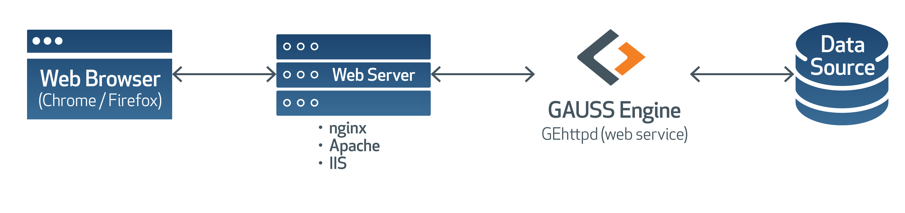
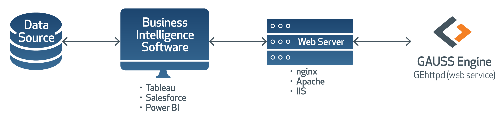

GEhttpd
*******

.. toctree::
   :maxdepth: 4

   index

Introduction
============

GEhttpd is a lightweight multi-threaded web server written in C++/Qt and
directly integrated with the GAUSS Engine. It allows users to implement their
algorithms in the `GAUSS <https://www.aptech.com>`_ matrix programming
language, and run those procedures with arguments supplied by requests to the
web server.

Although intended to be used behind another web server such as Apache or
nginx as a Reverse Proxy, it can be used standalone as well. Other notable
features are:

#. Session handling (cookies for maintaining state per user)
#. SSL support
#. Logging
#. Templating (for internal usage)

Below are two popular use-cases where one might use GEhttpd to run GAUSS code:

Web browser workflow
--------------------

A common scenario with the web browser client might be scripts executing on a
page with real-time input from the user to run algorithms return the result.

Business Intelligence workflow
------------------------------

Note that BI software is able to interface directly in a scenario such as this
as the application server would be running on an internal network, but placing
Apache or nginx in front allows for greater flexibility and security.

Installation
============

All file paths specified will assume the root is the directory `GEhttpd` was
installed to.

#. Extract the GEhttpd archive file (:file:`gehttpd.tar.gz` or
   :file:`gehttpd.zip`) to a directory of your choice.

#. Rename the file :file:`etc/gehttpd.ini.sample` to :file:`etc/gehttpd.ini`
   for configuration in the next section.

Minimum Requirements
--------------------

Linux
+++++

Make sure all the necessary dependencies are installed. You can run
``ldd chrome | grep not`` on a Linux machine to check which dependencies are
missing.

- Tested on Debian 9 and 10, as well as CentOS 6 and 7.
- Ubuntu and OpenSuSE should also run it as well, though not all versions have
  been tested.

For Debian based (e.g. Ubuntu systems);

::

  sudo apt install libglu1-mesa libxcomposite1 libxrender1 libfontconfig1

``xvfb`` may be required on headless systems:

::

  sudo apt install libxi6 xvfb

In lieu of that, enable user namespace cloning in the kernel with the
following command:

::

  sudo sysctl -w kernel.unprivileged_userns_clone=1

Windows
+++++++

- Tested on Windows 8 and 10.
- Usage with Windows 7 or prior is not guaranteed.

Quick Start
===========

After the previous `Installation` instructions are complete, only one key
modification is required to the :file:`etc/gehttpd.ini` file to run the
provided example files.

- Set the value of the **gehttpd > home** key to the installation directory of
  the GAUSS Engine:

  ::

    [gehttpd]
    home=/home/research/gauss20

Any custom routing files must be specified in the **[gettpd] > filenames** key.
To use the example routes, the key can be left with its default value.

Once this is complete, the section `Running the Server` can be read.

Configuration
=============

For basic purposes of running files other than the provided example files

The following are all sections listed sequentially in the
:file:`etc/gehttpd.ini` configuration file and list each key's default value.

[listener]
----------

::

  ;host=127.0.0.1
  port=5050
  minThreads=4
  maxThreads=100
  cleanupInterval=60000
  readTimeout=60000
  ;sslKeyFile=ssl/key.pem
  ;sslCertFile=ssl/cert.pem
  maxRequestSize=16000
  maxMultiPartSize=10000000
  asynchronous=1

:host: The network interface to listen on when starting the web server. The
  default behavior is to bind to all available network interfaces. Uncomment
  the line and use *127.0.0.1* to prevent responding to requests from any
  outside sources.

:port: The default port to bind to. If running behind Apache or nginx as a
  Reverse Proxy, do **not** set this to 80 or 443.

:minThreads: The minimum number of threads to be reserved by the connection
  pool when waiting for requests. Ignored if `asynchronous` is set to 0.

:maxThreads: The maximum number of threads allowed for the connection pool to
   spawn when responding to requests. Ignored if `asynchronous` is set to 0.

:cleanupInterval: How often the connection pool is cleaned up. Removes idle
  threads until `minThreads` is reached. Ignored if `asynchronous` is set to 0.

:readTimeout: Duration connection will remain idle before timing out
  automatically.

:sslKeyFile: Path to the SSL private key. Expects RSA key in PEM format.

:sslCertFile: Path to the local SSL certificate. Expects PEM format.

:maxRequestSize: The maximum size of a HTTP request in bytes.

:maxMultiPartSize: The maximum size of the body of a multipart/form-data
  HTTP request in bytes.

:asynchronous: Whether a thread pool is used for handling incoming requests.
  If this is set 0 then all incoming requests are handled sequentially and ran
  in the main server thread. This should be used for special use-cases where
  the app server needs all requests to run through the main thread, such as
  running procedures that generate graphs.

[gehttpd]
---------

::

  home=/home/research/mteng20
  filenames=test/sample.e|test/echo.e
  persistentWorkspace=0

:home: The full path to the installation directory of the GAUSS Engine.
  This is required and GEhttpd will fail to run if not set properly.

:filenames: A list of filenames separated by the pipe ``|`` character. These paths
  are relative to the gehttpd installation directory. Each file will be
  processed for configured GAUSS procedures and their associated URL endpoints.

  At least one filename must be provided.

:persistentWorkspace: Boolean flag (0 or 1) that determines whether state is
  maintained for clients. This allows a GAUSS workspace to be saved in between
  requests by clients and the ability for the state of the workspace after the
  last request to be used for new requests. Depending on the type of work
  performed this can potentially be large, especially with numerous clients.
  If not enabled, a fresh workspace and/or workspace with specified initial
  state will be used when handling new requests.

  Use with caution.

[templates]
-----------

::

  path=templates
  suffix=.tpl
  encoding=UTF-8
  cacheSize=1000000
  cacheTime=60000

:path: The path where the template files can be found. This can be either an
  absolute path or relative path from the :file:`gehttpd/etc` directory.

:suffix: The default suffix of the template files.

:encoding: The encoding that is sent to the web browser in case of text files.

:cacheSize: The size of the server cache in bytes.

:cacheTime: The duration in milliseconds of cache items before they expire.
  Setting this to 0 will disable expiration.

[docroot]
---------

::

  path=docroot
  encoding=UTF-8
  maxAge=60000
  cacheTime=60000
  cacheSize=1000000
  maxCachedFileSize=65536

:path: The path where the HTML files can be found. This can be either an
    absolute path or relative path from the :file:`gehttpd/etc` directory.

:encoding: The encoding that is sent to the web browser in case of text files.

:maxAge: The duration in milliseconds the file should reside in the browsers
  cache. Setting this to 0 will disable expiration.

:cacheTime: The duration in milliseconds of cache items before they expire.
  Setting this to 0 will disable expiration.

:cacheSize: The size of the server cache in bytes.

:maxCachedFileSize: The maximum size in bytes of a specific file in the server
  cache.

[sessions]
----------

::

  expirationTime=3600000
  cookieName=gehttpd
  cookiePath=/
  cookieComment=Stores persistent GAUSS workspace
  ;cookieDomain=

:expirationTime: The duration in milliseconds before the cookie will expire.

:cookieName: The name of the cookie to store in the browser.

:cookiePath: The URL path where the session is valid. This is useful when you
   have data not related to the session in ``/static/`` and session related data
   in ``/content/`` or similar.

:cookieComment: A comment to describe the cookie. This may be displayed by the
  client's web browser somewhere.

:cookieDomain: The domain the cookie will be defined to. Defaults to the current
  domain (determined by the client browser).

[logging]
---------

::

  fileName=../logs/gehttpd.log
  minLevel=1
  bufferSize=100
  maxSize=1000000
  maxBackups=2
  timestampFormat=dd.MM.yyyy hh:mm:ss.zzz
  msgFormat={timestamp} {typeNr} {type} {thread} {msg}
  ; QT5 supports: msgFormat={timestamp} {typeNr} {type} {thread} {msg}\n in {file} line {line} function {function}

:fileName: The file path where the log content will be written. This can be an
  absolute path or a path relative from the :file:`gehttpd/etc` directory.

:minLevel: Minimum level of message types that are written out directly or
 trigger writing the buffered content.

:bufferSize: Defines the size of the ring buffer in
  bytes.

  Setting this to 0 means unlimited.

:maxSize: The maximum size of the log file in bytes. The file will be backed up
  and	replaced by a new file if it becomes larger than this limit. Please note
  that the actual file size may become a little bit larger than this limit.

  Setting this to 0 means unlimited.

:maxBackups: The number of backup files to
  keep.

  Setting this to 0 means unlimited.

:timestampFormat: The format of
  timestamps.

  These expressions may be used for the date:

  =========== ===============================================
  Expression  Output
  =========== ===============================================
  d           the day as number without a leading zero (1 to 31)
  dd          the day as number with a leading zero (01 to 31)
  ddd         the abbreviated localized day name (e.g. 'Mon' to 'Sun'). Uses the system locale to localize the name.
  dddd        the long localized day name (e.g. 'Monday' to 'Sunday'). Uses the system locale to localize the name.
  M           the month as number without a leading zero (1-12)
  MM          the month as number with a leading zero (01-12)
  MMM         the abbreviated localized month name (e.g. 'Jan' to 'Dec'). Uses the system locale to localize the name.
  MMMM        the long localized month name (e.g. 'January' to 'December'). Uses the system locale to localize the name.
  yy          the year as two digit number (00-99)
  yyyy        the year as four digit number
  =========== ===============================================

  These expressions may be used for the time:

  =========== ===============================================
  Expression  Output
  =========== ===============================================
  h           the hour without a leading zero (0 to 23 or 1 to 12 if AM/PM display)
  hh          the hour with a leading zero (00 to 23 or 01 to 12 if AM/PM display)
  H           the hour without a leading zero (0 to 23, even with AM/PM display)
  HH          the hour with a leading zero (00 to 23, even with AM/PM display)
  m           the minute without a leading zero (0 to 59)
  mm          the minute with a leading zero (00 to 59)
  s           the whole second without a leading zero (0 to 59)
  ss          the whole second with a leading zero where applicable (00 to 59)
  z           the fractional part of the second, to go after a decimal point, without trailing zeroes (0 to 999). Thus "s.z" reports the seconds to full available (millisecond) precision without trailing zeroes.
  zzz         the fractional part of the second, to millisecond precision, including trailing zeroes where applicable (000 to 999).
  AP or A     use AM/PM display. A/AP will be replaced by either "AM" or "PM".
  ap or a     use am/pm display. a/ap will be replaced by either "am" or "pm".
  t           the timezone (for example "CEST")
  =========== ===============================================

  All other input characters will be ignored. Any sequence of characters that
  are enclosed in single quotes will be treated as text and not be used as an
  expression. Two consecutive single quotes ("''") are replaced by a single
  quote in the output. Formats without separators (e.g. "HHmm") are currently
  not supported.

  Example format strings (assumed that the date/time is 21 May 2001
  14:13:09.120):

  ================ ===============================================
  Format           Result
  ================ ===============================================
  dd.MM.yyyy       21.05.2001
  ddd MMMM d yy    Tue May 21 01
  hh:mm:ss.zzz     14:13:09.120
  hh:mm:ss.z       14:13:09.12
  h:m:s ap         2:13:9 pm
  ================ ===============================================

  If the datetime is invalid, an empty string will be returned.

:msgFormat: The format of log message
  entries.

  The following variables may be used in the message and in msgFormat:

  - ``{timestamp}`` Date and time of creation
  - ``{typeNr}``    Type of the message in numeric format (0-3)
  - ``{type}``      Type of the message in string format (DEBUG, WARNING, CRITICAL, FATAL)
  - ``{thread}``    ID number of the thread
  - ``{msg}``       Message text
  - ``{xxx}``       For any user-defined logger variable

Define URL Endpoints (Routes)
=============================

Endpoints are the core of request-handling in GEhttpd, and are simply
definitions for how to direct requests to the appropriate GAUSS procedures to
handle them and return a response.

A sample web request might have the following steps:

#. The client sends a request to GEhttpd
#. GEhttpd looks at the URL in the request and determines which GAUSS procedure
   to run. The arguments from the request are passed to the GAUSS procedure and
   the function is evaluated.
#. The result is encoded in the requested format (json, xml, or raw [plain]) and
   sent back to the client.

We define these endpoints directly in GAUSS code, and the files that make up
these definitions are specified the ``filenames`` key of the
:file:`gehttpd.ini` configuration file.

A URL route to GAUSS proc mapping consists of 3 steps:

#. Include the :file:`gehttpdroutes.src` file. This is only necessary once per
   source file.
#. Define the GAUSS procedure (proc)
#. Use the :func:`route` function to tell GEhttpd how to handle the proc and
   associated URL path.

The :func:`route` function takes the following form:

Format
------

::

   route(url, procname, args);

Parameters
++++++++++

:url: *string*, the relative path used to access the GAUSS proc from a client.
  Always starts with a forward-slash ``'/'``.

:procname: *string*, the name of the GAUSS proc to execute when the specified
  URL is accessed.

:args: *string*, ordered comma-delimited list of arguments that the proc
  accepts. These argument names must match the web request parameter names
  **exactly**. This argument determines the correct ordering when calling the
  GAUSS proc.

  .. NOTE:: Prefixing an argument with a specific character can change the way
    GEhttpd treats the argument when processing the request. The below table
    shows the available prefixes and the corresponding type coercion that
    occurs. This allows routes to ensure that arguments come in as the
    anticipated type. The exception to this is the ``@`` prefix, as this
    functions more as validation.

  ======== ============================
  Prefix   Forced Argument Type
  ======== ============================
  ``$``    String
  ``#``    Numeric scalar
  ``@``    File
  ======== ============================

  As a quick example, specifying an argument as ``@myfile`` would ensure that
  a user could not just enter in a string of a system path. It ensures that
  the ``myfile`` argument is passed in as a file.

The following 2 styles are understood by GAUSS when defining routes.

Style 1: GET/POST arguments
---------------------------

This style is the traditional method of passing arguments, whether in the URL
through ``?key=value&key1=value1`` pairs in a *GET* request, or in the body of
a *POST* request.

Addition example
++++++++++++++++

::

  // Step 1: Include the gehttpdroutes.src file
  #include gehttpdroutes.src

  // Step 2: Define the GAUSS proc
  proc (1) = my_add_proc(a, b);
      retp(a+b);
  endp;

  // Step 3: Instruct gehttpd how to handle this proc.
  route("/add", "my_add_proc", "a,b");

Forced string example
+++++++++++++++++++++

::

  // Step 1: Include the gehttpdroutes.src file
  #include gehttpdroutes.src

  // Step 2: Define the GAUSS proc
  proc (1) = hello(name);
      retp("Hello " $+ name);
  endp;

  // Step 3: Instruct gehttpd how to handle this proc.
  route("/hello", "hello", "$name");

File upload example
+++++++++++++++++++

**Note:** File uploading is only supported for multipart fields in a *POST*
request. The uploaded file is saved to a temporary file and the filename is
passed to the proc.

::

  #include gehttpdroutes.src

  proc (0) = my_dstatmt_proc(file, formula);
      call dstatmt(file, formula);
  endp;

  route("/dstatmt", "my_dstatmt_proc", "@file, $formula");

Style 2: RESTful arguments
--------------------------

This style passes arguments in the URL itself, as shown. Because they are passed
in this manner, only numeric scalars and strings can be passed with this style.

Argument types
++++++++++++++

By default, GAUSS treats an argument supplied in a REST request as a numeric
scalar. Remember that the :func:`route` proc allows marking arguments as a
string by prefixing them with the ``$`` character, as follows:

Forced string example
+++++++++++++++++++++

::

  // Step 1: Include the gehttpdroutes.src file
  #include gehttpdroutes.src

  // Step 2: Define the GAUSS proc
  proc (1) = hello(name);
      retp("Hello " $+ name);
  endp;

  // Step 3: Instruct gehttpd how to handle this proc.
  route("/hi/<name>", "hello", "$name");

Addition example
++++++++++++++++

Note the multiple ways of calling the same GAUSS proc.

::

  // Step 1: Include the gehttpdroutes.src file
  #include gehttpdroutes.src

  // Step 2: Define the GAUSS proc
  proc (1) = my_add_proc(a, b);
      retp(a+b);
  endp;

  // Step 3: Instruct gehttpd how to handle this proc.
  route("/add/<a>/<b>", "my_add_proc", "a,b");

  // Alternative
  route("/add/<a>/plus/<b>", "my_add_proc", "a,b");

  // Alternative
  route("/<a>/plus/<b>", "my_add_proc", "a,b");

Running the Server
==================

Once the :file:`etc/gehttpd.ini` file has been configured, GEhttpd can be
started with the provided :file:`run.sh` (Linux) or :file:`run.bat` file.

Executing this in the terminal will set the appropriate environment variables
and start the server. It is recommended that at least on Linux this is ran in
a ``screen`` or ``tmux`` session, as only launching as a background task with
``&`` will still end the process upon logging out of the ssh session that
started it.

If executing GEhttpd with ``xvfb``, the following command use a 1920x1080
buffer by default:

::

  $ xvfb-run ./run.sh

Reverse Proxy
-------------

Apache
++++++

*TODO*

nginx
+++++

*TODO*

Making a Request
================

The following are valid methods of constructing a request that GEhttpd will
understand.

GET / RESTful requests
----------------------

GET The most basic method: arguments are passed in the URL as ``key=value`` pairs,
starting after a ``?`` character, with additional pairs separated by the ``&``
character.

#. ``curl -X GET http://localhost:5050/hello?name=Bob``
#. ``curl -X GET http://localhost:5050/add?a=5&b=10``

RESTful requests are technically just requests using the GET method, but embed
the key in locations of the URL indicated by the predefined ``route`` pattern.

Example from the previous *add* route:

#. ``curl -X GET http://localhost:5050/add/5/10``
#. ``curl -X GET http://localhost:5050/add/5/plus/10``

POST request
------------

POST requests embed the key=value pairs in the body of the request. They are
not visible directly in the URL.

#. ``curl -X POST -d "name=Bob" http://localhost:5050/hello``
#. ``curl -X POST -d "a=5&b=10" http://localhost:5050/add``

POST request with JSON arguments
--------------------------------

POST requests with key=JSON and full JSON body POST requests allow specifying
more complex symbol types, such as matrices and string arrays. We can
send multiple elements and their corresponding dimensions and type with the
following JSON structure:

::

  {
    "type": "scalar/matrix/string/string array",
    "rows": n,
    "cols": m,
    "data": ...
  }

:type:
  string representing the GAUSS symbol type. Valid options are:

  - scalar
  - matrix
  - string
  - string array

:rows: numeric scalar representing number of rows. Must be conformable to size
  of `data` when combined with `cols`. Optional if `data` is an Nx1 vector.

:cols: numeric scalar representing number of columns. Must be conformable to
  size of `data` when combined with `rows`. Optional if `data` is an Nx1 vector.

:data: appropriate JSON data type based on symbol type described in `type`
  field.

A few examples are below:

Numeric vector argument
+++++++++++++++++++++++

::

  {
    "type": "matrix",
    "data": [1, 2, 3, 4]
  }

We can include the ``rows`` and ``cols`` keys to specify the dimensions:

Matrix with rows and columns
++++++++++++++++++++++++++++

::

  {
    "type": "matrix",
    "data": [1, 2, 3, 4],
    "rows": 2,
    "cols": 2
  }

String array
++++++++++++++++++++++++++++

::

  {
    "type": "string array",
    "data": ["M", "F", "M", "M"]
  }

string
++++++++++++++++++++++++++++

::

  {
    "type": "string array",
    "data": ["M", "F", "M", "M"]
  }

POST request with JSON body
---------------------------

Quite possibly the most flexible for dealing with various symbols, a full JSON
body gives us quite a bit of flexibility and due to many languages being able to
convert a dictionary to a JSON object, ease-of-use passing data to GEhttpd.

Note that because we're using the body of the request, the JSON document
**keys** represent the input argument names:

::

  {
    "name":
    {
      "type": "scalar/matrix/string/string array",
      "rows": n,
      "cols": m,
      "data": ...
    },
    ...
  }

:name: The name of the input argument to the proc to be called. This must match
  one of the input names specified in the :func:`route` call exactly. The order
  match is required and it is used to determine the order of the arguments
  when calling executing the proc.

:type:
  string representing the GAUSS symbol type. Valid options are:

  - scalar
  - matrix
  - string
  - string array

  Optional

:rows: numeric scalar representing number of rows. Must be conformable to size
  of `data` when combined with `cols`. Optional if `data` is an Nx1 vector.

:cols: numeric scalar representing number of columns. Must be conformable to
  size of `data` when combined with `rows`. Optional if `data` is an Nx1 vector.

:data: appropriate JSON data type based on symbol type described in `type`
  field.

#. ::

       $ curl -X POST -H "Content-Type: application/json" -d '{"name": "Bob"}}' http://localhost:5050/hello
#. ::

       $ curl -X POST -H "Content-Type: application/json" -d '{"a": 5, "b": 10}}' http://localhost:5050/add
#. ::

       $ curl -X POST -H "Content-Type: application/json" -d '{"a": {"type": "matrix", "data": [1, 2, 3, 4], "rows": 2, "cols": 2}, "b": 10}}' http://localhost:5050/add

GEhttpd can also deduce a pure numeric vector and automatically treat it as a
matrix:

#. ::

       $ curl -X POST -H "Content-Type: application/json" -d '{"a": [1, 2, 3, 4]}, "b": 10}}' http://localhost:5050/add

or as a string array vector:

#. ::

       $ curl -X POST -H "Content-Type: application/json" -d '{"name": ["Bob", "Alice", "Mike"]}' http://localhost:5050/hello

The Response
============

A successful response will by default return a JSON object with the following
structure:

::

  {
    "success": true,
    "output": "",
    "results": [
      {
        "type": "matrix",
        "rows": 5,
        "cols": 1,
        "data": [1.0,2.0,3.0,4.0,5.0]
      }
    ]
  }

:success: ``true`` if the proc returned without error and ``false`` if the proc
  was unable to succesfully complete.

:output: any output emitted by the program while running. This would include
  the contents of any :func:`print` (implicit or explicit) statement(s) in the
  program.

:results: an array of return values represented as JSON objects from the proc.
  Will always return an array. The JSON objects will follow the same structure
  as JSON objects accepted in the section `POST request with JSON arguments`_

